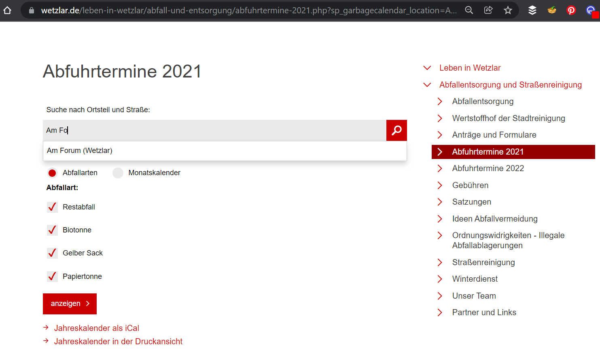

# Abfallkalender

Die Stadt Wetzlar bietet auf der Seite der [Abfallentsorgung Wetzlar](https://www.wetzlar.de/leben-in-wetzlar/abfall-und-entsorgung/)

* für jede Straße
* für jedes Jahr

die Abfuhrtermine al iCal Download an.
Was fehlt ist eine Uhrzeit und ein entsprechender Alarm vorher. 
Deshalb fügt dieses Programm folgende Daten automatisch hinzu

* Abfuhrtermine werden auf 5:00 bis 6:00 Uhr morgens gesetzt
* zwei Benachrichtigungen 11 und 12 Stunden vorher => 18:00 und 19:00 Uhr des Vortag

Wählt auf der Webseite das entsprechende Jahr auswählen.
Danach die Strasse zur Abholung suchen und auswählen.
Die Download Datei `abfallkalender.ics` unter `resources` abspeichern
Jetzt das Programm `main` ausführen.
Die neue Datei `AbfallkalenderMitErinnerung-out.ics` wird ebenfalls im Ordner `resources` erzeugt.
Diese Datei einfach in den Kalender Eurer Wahl importieren und Ihr bekommt Benachrichtigungen zu den Terminen.

